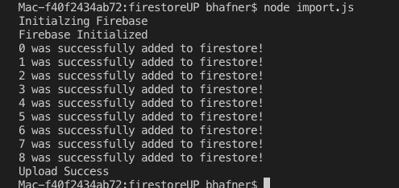

# Cloud Firestore JSON file upload

Article by Jeff Lewis on Upload: https://levelup.gitconnected.com/firebase-import-json-to-firestore-ed6a4adc2b57

This is a handy tool if you need to seed data into Cloud Firestore

Background:
----------------------------------------------------
You can't simply import a JSON file into Firestore as you can with the Realtime Database.  I've had to switch to FireStore since the Realtime DB will only let you query on one item at a time.

Technology:
----------------------------------------------------
This process uses the npm package "firestore-export-import".

Screenshot for Cloud FireStore Import:
--------------------------------

